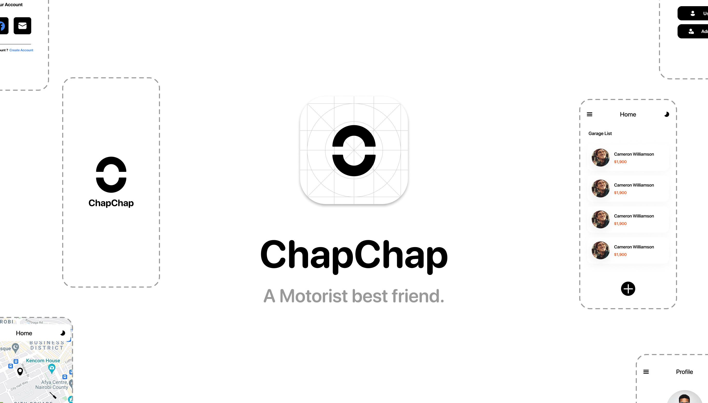

<p align="center"></p>

# ChapChap

This monorepo contains the following repositories:

- `chapchap-firebase`: Contains configuration files and scripts for setting up and managing a Firebase project.
- `chapchap-client`: Contains the source code for a Chapchap client project.
- `chapchap-www`: Contains the source code for landing website and page where users can download the chapchap app.

## Getting started

To get started with this monorepo, you'll need to have the following dependencies installed:

- Node.js
- Firebase CLI
- Flutter

Once you have these dependencies installed, you can clone this monorepo and setup each repository according to each project readme.


## Usage

To use this monorepo, you'll need to set up each repository as described in their respective README files. For example, to set up the Firebase Configuration repository, you'll need to create a Firebase project and connect it to the repository as described in the Firebase Configuration README.

## Submodules

This monorepo uses Git submodules to manage the Download Page and Landing Page repositories. To set up the submodules, run the following command:

```bash
$ git submodule init

$ git submodule update
```

To update the submodules, run the following command:

```bash 
$ git submodule update --remote
```


## Troubleshooting

If you run into any issues while using this monorepo, check the following:

- Make sure you have the required dependencies installed.
- Check the README files for each repository to see if there are any specific troubleshooting tips.
- If you're having trouble with the submodules, make sure you have run the `git submodule` commands correctly.

## Contributing

We welcome contributions to this monorepo! If you'd like to report a bug or request a feature, please open an issue on GitHub. If you'd like to submit a code change, please follow these guidelines:

- Fork this repository and create a new branch for your change.
-


